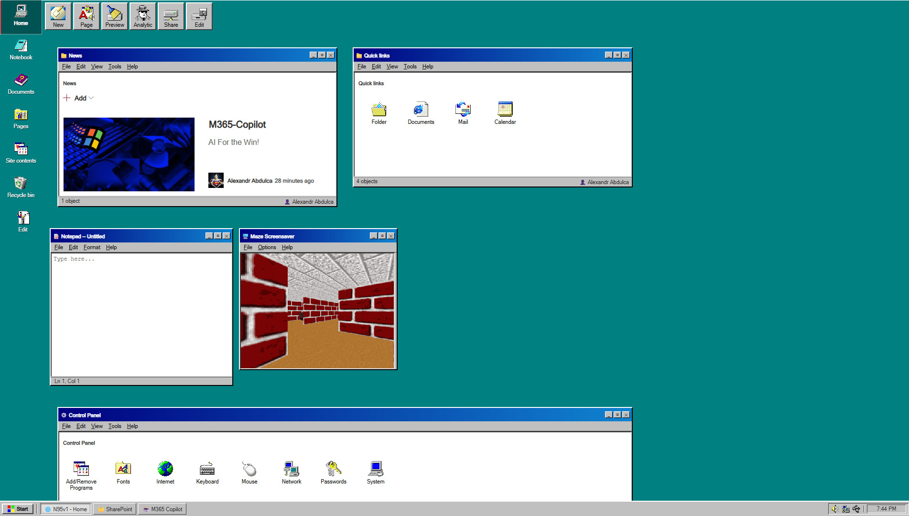

# 🖥️ Win95 SharePoint Theme

An SPFx Application Customizer that transforms a modern SharePoint site into a **Windows 95 desktop experience**.



---

## ✨ Features

- **Teal `#008080` desktop** background replacing the SharePoint canvas
- **Win95 taskbar** with Start menu, live clock, system tray, and task buttons for SharePoint and M365 Copilot
- **Web parts wrapped** in Win95 Explorer-style windows (title bar, menu bar, status bar)
- **Document Library** pages replaced with a full two-pane Win95 Explorer (tree + icon grid)
- **Quick Links** styled as Win95 icon grids, with special Control Panel styling
- **Left navigation** restyled as Win95 desktop icons
- **Command bar** buttons converted to Win95 toolbar buttons
- **Notepad** window on the home page (functional, tracks cursor position)
- **Cycling screensaver** window — click to rotate between Maze, Nostalgia and Pipes

---

## 📋 Prerequisites

- Node.js **v18**
- SPFx **1.18+**
- SharePoint tenant with App Catalog access
- Permissions to upload to `SiteAssets`

---

## 🚀 Installation

### 1. Clone and install

```bash
git clone https://github.com/niacrisss/win95-sharepoint-theme.git
cd win95-sharepoint-theme
npm install
```

### 2. Build and package

```bash
gulp bundle --ship
gulp package-solution --ship
```

This produces `sharepoint/solution/win95-theme.sppkg`.

### 3. Deploy to App Catalog

1. Go to `https://[tenant].sharepoint.com/sites/appcatalog`
2. Navigate to **Apps for SharePoint**
3. Upload `win95-theme.sppkg`
4. When prompted, check **"Make this solution available to all sites"** for tenant-wide deployment
5. Click **Deploy**

### 4. Add to your site

1. Go to your site → **Site contents → New → App**
2. Find **Win95 Theme** and click **Add**

---

## 🎨 Asset Setup

All icons and GIFs must be uploaded to:

```
{siteUrl}/SiteAssets/win95icons/
```

### Required icons

| File | Used for |
|------|----------|
| `tray-volume.png` | System tray |
| `tray-network.png` | System tray |
| `tray-battery.png` | System tray |
| `nav-home.png` | Left nav |
| `nav-notebook.png` | Left nav |
| `nav-documents.png` | Left nav |
| `nav-pages.png` | Left nav |
| `nav-sitecontents.png` | Left nav |
| `nav-recycle.png` | Left nav |
| `nav-edit.png` | Left nav |
| `nav-calendar.png` | Left nav |
| `nav-mail.png` | Left nav |
| `nav-people.png` | Left nav |
| `nav-news.png` | Left nav |
| `nav-search.png` | Left nav |
| `nav-settings.png` | Left nav |
| `ql-folder.png` | Quick Links |
| `ql-documents.png` | Quick Links |
| `ql-mail.png` | Quick Links |
| `ql-calendar.png` | Quick Links |
| `cp-addremove.png` | Control Panel web part |
| `cp-fonts.png` | Control Panel web part |
| `cp-internet.png` | Control Panel web part |
| `cp-keyboard.png` | Control Panel web part |
| `cp-mouse.png` | Control Panel web part |
| `cp-network.png` | Control Panel web part |
| `cp-passwords.png` | Control Panel web part |
| `cp-system.png` | Control Panel web part |
| `expl-1.png` … `expl-6.png` | Document Library Explorer |
| `new.png`, `edit.png`, `share.png`, `preview.png`, `analytics.png`, `details.png`, `publish.png` | Command bar |

### Required GIFs (screensaver window)

| File | Label |
|------|-------|
| `maze-screensaver.gif` | Maze Screensaver |
| `nostalgia-screensaver.gif` | Nostalgia Screensaver |
| `pipes-screensaver.gif` | Pipes Screensaver |

---

## 🖥️ Console API

Open the browser console on any page where the theme is installed:

```js
__win95theme.enable()    // apply theme and save to localStorage
__win95theme.disable()   // remove theme and save to localStorage
__win95theme.toggle()    // flip current state
__win95theme.isEnabled() // returns true if theme is active
```

---

## 📁 Project Structure

```
src/
  extensions/
    win95Theme/
      Win95ThemeApplicationCustomizer.ts  — main customizer entry point
      Win95Explorer.ts                    — two-pane Explorer overlay
      Win95Styles.ts                      — Win95 CSS (stable chrome)
      Win95SpOverrides.ts                 — SharePoint-specific CSS overrides
```

---

## ⚠️ Maintenance Notes

### Hashed CSS class names
SharePoint's shell uses obfuscated class names (e.g. `_a87ce8ff`) that **change when Microsoft redeploys**. If the teal background or nav colours stop working after a SharePoint update, open DevTools and update the selectors in the `SP_HASHED_OVERRIDES` section of `Win95SpOverrides.ts`.

The `SP_STABLE_OVERRIDES` section uses semantic IDs and `data-*` attributes and is much less likely to break.

### Quick Links titles
Quick link titles are read from the SP DOM asynchronously. The styler retries at 1.5s, 3s and 6s after load. If icons show "Link" on first load, they will correct themselves within a few seconds.

---

## 📄 License

MIT

---

*Built with ❤️ and nostalgia by [niacrisss](https://github.com/niacrisss)*
